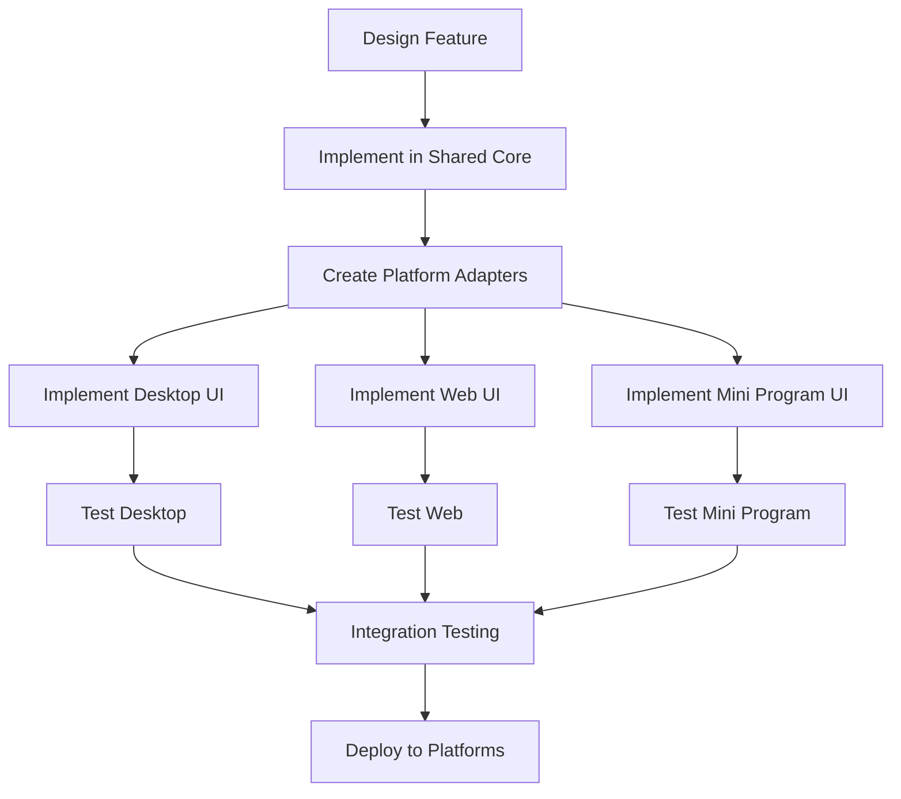

# Cross-Platform Development Guide

This guide provides comprehensive instructions for setting up and developing across all Quick Transpose platforms: Desktop (Electron), Web (React), and WeChat Mini Program.

## Table of Contents

1. [Prerequisites](#prerequisites)
2. [Project Structure Overview](#project-structure-overview)
3. [Development Environment Setup](#development-environment-setup)
4. [Platform-Specific Development](#platform-specific-development)
5. [Shared Core Development](#shared-core-development)
6. [Cross-Platform Workflows](#cross-platform-workflows)
7. [Testing Across Platforms](#testing-across-platforms)
8. [Build and Deployment](#build-and-deployment)
9. [Troubleshooting](#troubleshooting)

## Prerequisites

### Required Software
- **Node.js** (v18.0.0 or higher)
- **npm** or **yarn** package manager
- **Git** for version control
- **VS Code** (recommended IDE with extensions)

### Platform-Specific Requirements

#### Desktop Development
- **Electron** development dependencies
- Platform-specific build tools:
  - Windows: Visual Studio Build Tools
  - macOS: Xcode Command Line Tools
  - Linux: build-essential package

#### Web Development
- Modern web browser (Chrome, Firefox, Safari, Edge)
- Browser developer tools

#### WeChat Mini Program Development
- **WeChat Developer Tools** (official IDE)
- WeChat developer account
- Test device or simulator

### Recommended VS Code Extensions
```json
{
  "recommendations": [
    "ms-vscode.vscode-typescript-next",
    "bradlc.vscode-tailwindcss",
    "esbenp.prettier-vscode",
    "ms-vscode.vscode-eslint",
    "ms-vscode.vscode-json"
  ]
}
```

## Project Structure Overview

```
quick-transpose/
├── src/                    # Desktop Application (Electron)
│   ├── main/              # Main process
│   ├── renderer/          # Renderer process
│   ├── shared/            # Desktop utilities
│   └── package.json       # Desktop dependencies
├── web/                   # Web Application
│   ├── src/              # React source code
│   ├── public/           # Static assets
│   ├── dist/             # Build output
│   └── package.json      # Web dependencies
├── miniprogram/          # WeChat Mini Program
│   ├── pages/           # Mini program pages
│   ├── components/      # Custom components
│   ├── utils/           # Mini program utilities
│   └── project.config.json # Mini program config
├── shared/               # Cross-Platform Core
│   ├── core/            # Business logic
│   ├── types/           # TypeScript definitions
│   ├── utils/           # Common utilities
│   └── package.json     # Shared dependencies
└── package.json         # Root dependencies
```

## Development Environment Setup

### 1. Initial Setup

```bash
# Clone the repository
git clone <repository-url>
cd quick-transpose

# Install root dependencies
npm install

# Install shared module dependencies
cd shared
npm install
cd ..

# Install desktop dependencies
cd src
npm install
cd ..

# Install web dependencies
cd web
npm install
cd ..
```

### 2. Environment Configuration

Create environment files for each platform:

#### Desktop Environment (`.env.desktop`)
```env
NODE_ENV=development
ELECTRON_IS_DEV=true
DEBUG_PROD=false
```

#### Web Environment (`.env.web`)
```env
NODE_ENV=development
REACT_APP_API_URL=http://localhost:3001
REACT_APP_VERSION=$npm_package_version
```

#### Mini Program Environment (`miniprogram/env.js`)
```javascript
const env = {
  development: {
    apiUrl: 'https://dev-api.example.com',
    debug: true
  },
  production: {
    apiUrl: 'https://api.example.com',
    debug: false
  }
};

module.exports = env[process.env.NODE_ENV || 'development'];
```

## Platform-Specific Development

### Desktop Application Development

#### Starting Development Server
```bash
cd src
npm run dev
```

#### Key Development Commands
```bash
# Start in development mode
npm run dev

# Build for production
npm run build

# Package for distribution
npm run dist

# Run tests
npm test

# Lint code
npm run lint
```

#### Desktop-Specific Considerations
- **Main Process**: Handle system integration, file operations, menu creation
- **Renderer Process**: UI components, user interactions
- **IPC Communication**: Secure communication between main and renderer processes
- **Auto-updater**: Implement secure update mechanism
- **Code Signing**: Required for distribution

#### Example Main Process Code
```typescript
// src/main/main.ts
import { app, BrowserWindow, ipcMain } from 'electron';
import { TransposeEngine } from '../../shared/core/transpose-engine';

class DesktopApp {
  private mainWindow: BrowserWindow | null = null;
  private transposeEngine: TransposeEngine;

  constructor() {
    this.transposeEngine = new TransposeEngine(new DesktopAdapter());
    this.setupIPC();
  }

  private setupIPC() {
    ipcMain.handle('transpose-chord', async (event, chord, steps) => {
      return this.transposeEngine.transpose(chord, steps);
    });
  }
}
```

### Web Application Development

#### Starting Development Server
```bash
cd web
npm run dev
```

#### Key Development Commands
```bash
# Start development server
npm run dev

# Build for production
npm run build

# Preview production build
npm run preview

# Run tests
npm test

# Type checking
npm run type-check
```

#### Web-Specific Considerations
- **Progressive Web App**: Service worker, offline functionality
- **Responsive Design**: Mobile-first approach
- **Performance**: Code splitting, lazy loading
- **SEO**: Meta tags, structured data
- **Accessibility**: WCAG compliance

#### Example Web Component
```typescript
// web/src/components/TransposeWidget.tsx
import React, { useState } from 'react';
import { TransposeEngine } from '../../../shared/core/transpose-engine';

const TransposeWidget: React.FC = () => {
  const [chord, setChord] = useState('');
  const [steps, setSteps] = useState(0);
  const [result, setResult] = useState('');

  const transposeEngine = new TransposeEngine(new WebAdapter());

  const handleTranspose = async () => {
    const transposed = await transposeEngine.transpose(chord, steps);
    setResult(transposed);
  };

  return (
    <div className="transpose-widget">
      {/* Component JSX */}
    </div>
  );
};
```

### WeChat Mini Program Development

#### Starting Development
1. Open WeChat Developer Tools
2. Import project from `miniprogram/` directory
3. Configure project settings
4. Start development server

#### Key Development Workflow
```bash
# In WeChat Developer Tools
# 1. Compile and preview
# 2. Real device testing
# 3. Upload for review
# 4. Submit for release
```

#### Mini Program-Specific Considerations
- **Package Size Limits**: 2MB main package, 20MB total
- **Component System**: Custom component architecture
- **API Limitations**: WeChat-specific APIs only
- **Performance**: Minimize startup time
- **User Experience**: WeChat design guidelines

#### Example Mini Program Page
```javascript
// miniprogram/pages/transpose/transpose.js
const { TransposeEngine } = require('../../utils/transpose-engine');

Page({
  data: {
    chord: '',
    steps: 0,
    result: ''
  },

  onLoad() {
    this.transposeEngine = new TransposeEngine(new MiniprogramAdapter());
  },

  async onTranspose() {
    const result = await this.transposeEngine.transpose(
      this.data.chord, 
      this.data.steps
    );
    this.setData({ result });
  }
});
```

## Shared Core Development

### Working with Shared Modules

#### Development Workflow
```bash
# Make changes to shared code
cd shared
npm run build

# Test changes across platforms
cd ../src && npm test
cd ../web && npm test
```

#### Shared Module Structure
```typescript
// shared/core/transpose-engine.ts
export class TransposeEngine {
  private adapter: PlatformAdapter;

  constructor(adapter: PlatformAdapter) {
    this.adapter = adapter;
  }

  // Platform-agnostic business logic
  transpose(chord: string, steps: number): string {
    // Implementation
  }
}

// shared/types/platform-adapter.ts
export interface PlatformAdapter {
  storage: StorageInterface;
  ui: UIInterface;
  audio?: AudioInterface;
}
```

#### Platform Adapters
Each platform implements its own adapter:

```typescript
// Desktop Adapter
class DesktopAdapter implements PlatformAdapter {
  storage = new ElectronStorage();
  ui = new ElectronUI();
  audio = new ElectronAudio();
}

// Web Adapter
class WebAdapter implements PlatformAdapter {
  storage = new WebStorage();
  ui = new WebUI();
  audio = new WebAudio();
}

// Mini Program Adapter
class MiniprogramAdapter implements PlatformAdapter {
  storage = new WechatStorage();
  ui = new WechatUI();
  // No audio support
}
```

## Cross-Platform Workflows

### 1. Feature Development Workflow



### 2. Code Synchronization

```bash
# Sync shared changes across platforms
npm run sync-shared

# Update all platform dependencies
npm run update-deps

# Run cross-platform tests
npm run test-all
```

### 3. Version Management

```json
{
  "scripts": {
    "version:patch": "npm version patch && npm run sync-versions",
    "version:minor": "npm version minor && npm run sync-versions",
    "version:major": "npm version major && npm run sync-versions",
    "sync-versions": "node scripts/sync-versions.js"
  }
}
```

## Testing Across Platforms

### Unit Testing Strategy

```bash
# Test shared core logic
cd shared && npm test

# Test platform-specific code
cd src && npm test      # Desktop tests
cd web && npm test      # Web tests
# Mini program tests run in WeChat DevTools
```

### Integration Testing

```bash
# Cross-platform integration tests
npm run test:integration

# End-to-end testing
npm run test:e2e:desktop
npm run test:e2e:web
npm run test:e2e:miniprogram
```

### Testing Configuration

#### Jest Configuration (shared/jest.config.js)
```javascript
module.exports = {
  preset: 'ts-jest',
  testEnvironment: 'node',
  roots: ['<rootDir>/src'],
  testMatch: ['**/__tests__/**/*.ts', '**/?(*.)+(spec|test).ts'],
  collectCoverageFrom: [
    'src/**/*.ts',
    '!src/**/*.d.ts',
  ],
};
```

## Build and Deployment

### Development Builds

```bash
# Build all platforms for development
npm run build:dev

# Build specific platform
npm run build:desktop:dev
npm run build:web:dev
npm run build:miniprogram:dev
```

### Production Builds

```bash
# Build all platforms for production
npm run build:prod

# Build and package for distribution
npm run dist:all
```

### Deployment Scripts

```bash
# Deploy web application
npm run deploy:web

# Package desktop applications
npm run package:desktop

# Submit mini program for review
npm run submit:miniprogram
```

## Troubleshooting

### Common Issues

#### 1. Shared Module Import Issues
```bash
# Rebuild shared module
cd shared && npm run build

# Clear node_modules and reinstall
rm -rf node_modules && npm install
```

#### 2. Platform-Specific Build Failures
```bash
# Clear platform build cache
npm run clean:cache

# Rebuild platform dependencies
npm run rebuild:platform
```

#### 3. Version Synchronization Issues
```bash
# Sync versions across all platforms
npm run sync-versions

# Check version consistency
npm run check-versions
```

### Debug Configuration

#### VS Code Launch Configuration (.vscode/launch.json)
```json
{
  "version": "0.2.0",
  "configurations": [
    {
      "name": "Debug Desktop App",
      "type": "node",
      "request": "launch",
      "cwd": "${workspaceFolder}/src",
      "program": "${workspaceFolder}/src/main/main.ts",
      "outFiles": ["${workspaceFolder}/src/dist/**/*.js"]
    },
    {
      "name": "Debug Web App",
      "type": "node",
      "request": "launch",
      "cwd": "${workspaceFolder}/web",
      "program": "${workspaceFolder}/web/src/index.tsx"
    }
  ]
}
```

### Performance Monitoring

```bash
# Analyze bundle sizes
npm run analyze:desktop
npm run analyze:web

# Performance profiling
npm run profile:desktop
npm run profile:web
```

## Best Practices

### 1. Code Organization
- Keep platform-specific code in respective directories
- Maximize shared code reuse through the shared module
- Use TypeScript interfaces for platform abstraction

### 2. Development Workflow
- Test changes in shared module across all platforms
- Use consistent coding standards across platforms
- Implement comprehensive error handling

### 3. Performance Optimization
- Lazy load non-critical components
- Optimize bundle sizes for each platform
- Implement efficient caching strategies

### 4. Documentation
- Document platform-specific implementations
- Maintain API documentation for shared modules
- Keep deployment guides up to date

---

*Cross-Platform Development Guide - Last Updated: January 2025*